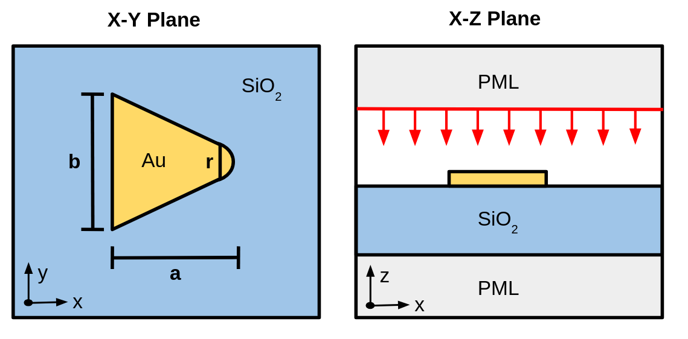

# Gold Nanoantenna Simulation

## Overview

This script simulates an optical pulse at normal incidence on a gold nanoantenna array. The field is polarized along the antennas altitude which for the purposes of this simulation is the x direction. The gold sits on a Si02 substrate. 

To run a trial simulation, simply make a copy of this folder and name it whatever you would like. Specify the inputs in the .yaml file, then select run all on the run.ipynb notebook. Note for consistent results, minimum resolution of 200 pixels/um is needed although 100 pixels/um is sufficent for debugging and qualitative behavior. 

## Dependencies
To run, make sure the following are installed:
1. Meep
2. yaml
3. Numpy
4. Matplotlib
5. Scipy
6. h5py